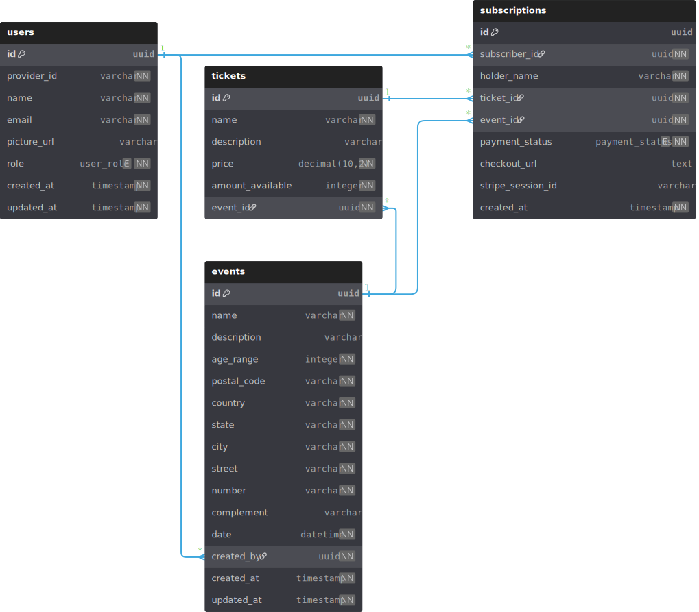

## Entity-Relationship Model

## Application Endpoints

### Client-facing endpoints

#### Users, Profile, Account & Auth
`GET /oauth2/authorization/google` Redirect you to Google login page  
`POST /logout` End your current session  
`POST /users/:userId/promote` Promote an user to organizer  
`POST /users/:userId/demote` Demote an organizer to user  
`GET /me` Get your profile info  
`PATCH /me` Edit your profile info  
`DELETE /me` Delete your account  

#### Events & Tickets
`POST /events` Create a new event  
`POST /events/:eventId/cancel` Cancel a specific event  
`GET /events` List all events  
`GET /events/:eventId` Get a specific event  
`PATCH /events/:eventId` Edit a specific event  
`DELETE /events/:eventId` Delete a specific event  
`POST /events/:eventId/tickets` Create a new ticket  
`GET /events/:eventId/tickets` List all tickets for an event  
`GET /tickets/:ticketId` Get a specific ticket for an event  
`PATCH /tickets/:ticketId` Edit a specific ticket for an event  
`DELETE /tickets/:ticketId` Delete a specific ticket for an event  

#### Registrations & Checkout Sessions
`POST /registrations` Register for an event  
`GET /events/:eventId/registrations?status={status}` List all event registrations, filtered by status or not  
`GET /me/registrations` Get your event registrations  
`GET /registrations/:registrationId` Get a specific registration  
`POST /registrations/:registrationId/refund` Mark a specific event registration as refunded  
`POST /checkout-sessions/:stripeSessionId/cancel` Cancel checkout session and invalidate registrations related  

### System integration endpoints
`POST /webhooks/stripe` Send payment event notifications (Stripe via webhook)