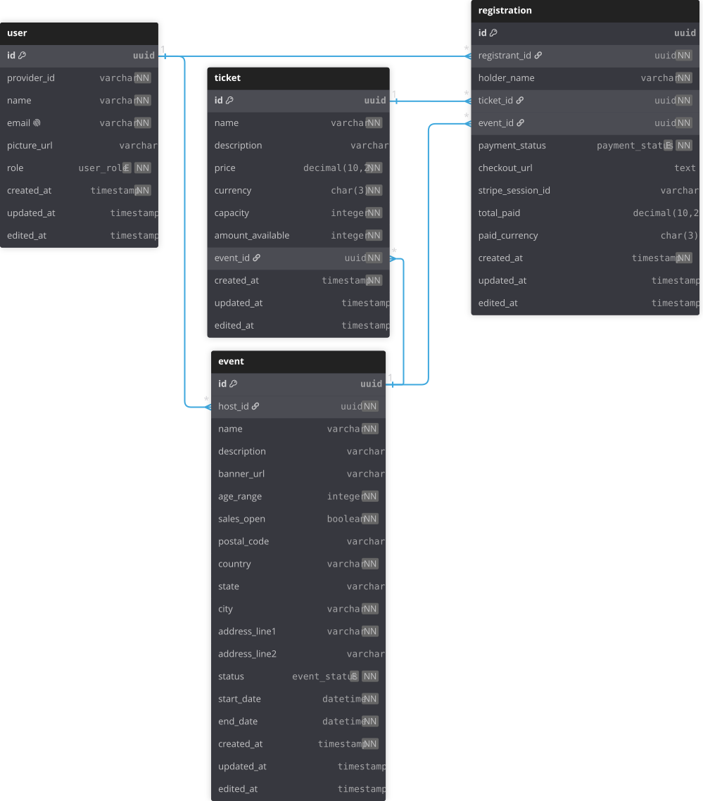

# SwiftPass

SwiftPass is a secure and automated event ticketing engine built with Spring Boot, following Clean Architecture and Domain-Driven Design principles. It handles seamless registration workflows, precise ticket availability control, and real-time payment synchronization through Stripe.

<br />

## Live Demo

A live demonstration is deployed and ready to explore (no local setup required).

1. Go to the login page: **[swiftpass-demo.up.railway.app/oauth2/authorization/google](https://swiftpass-demo.up.railway.app/oauth2/authorization/google)**
2. Sign in with your Google account.
3. You will be automatically redirected to the **Swagger UI**, where every endpoint is documented and ready to be tested. All authenticated users on the demo environment are automatically granted the `ORGANIZER` role, so you can freely create events, tickets, and explore the full API surface.

<br />

## Entity-Relationship Diagram



<br />

## Running Locally

If you'd like to run SwiftPass on your own machine, follow the steps below.

### Prerequisites

- [Java 23 (Eclipse Temurin)](https://adoptium.net/temurin/releases/?version=23) installed on your machine.
- [Docker](https://www.docker.com/get-started/) installed and running, used to spin up the local PostgreSQL database.
- [Stripe CLI](https://docs.stripe.com/stripe-cli/install) installed, used to forward Stripe webhook events to your local environment.
- A [Google Cloud OAuth 2.0 Client](https://console.cloud.google.com/apis/credentials) for authentication.
- A [Stripe account](https://dashboard.stripe.com/register) with API keys in **test mode**.

### 1. Clone the repository

```bash
git clone https://github.com/feponiel/swiftpass.git
cd swiftpass
```

### 2. Set up your environment variables

Create a `.env.dev` file in the root of the project. You can use [.env.example](.env.example) as a reference for every variable required.

```bash
# Your .env.dev file will look like this
DATABASE_URL=jdbc:postgresql://localhost:5432/swiftpass
DATABASE_USER="YOUR_DATABASE_USER"
DATABASE_PASSWORD="YOUR_DATABASE_PASSWORD"

GOOGLE_CLIENT_ID="YOUR_GOOGLE_OAUTH_CLIENT_ID"
GOOGLE_CLIENT_SECRET="YOUR_GOOGLE_OAUTH_CLIENT_SECRET"

STRIPE_SECRET_KEY="YOUR_STRIPE_TEST_SECRET_KEY"
STRIPE_WEBHOOK_SECRET="YOUR_STRIPE_WEBHOOK_SIGNING_SECRET"
```

#### It's good to remember:

1. To get your **Google OAuth credentials**, create a project on the [Google Cloud Console](https://console.cloud.google.com/apis/credentials), configure an OAuth consent screen, and create an **OAuth 2.0 Client ID** of type "Web application". Add `http://localhost:8080` to the Authorized JavaScript origins, and `http://localhost:8080/login/oauth2/code/google` to the Authorized redirect URIs.
2. To get your **Stripe Secret Key**, go to the [Stripe Dashboard API Keys page](https://dashboard.stripe.com/test/apikeys) (make sure "Test mode" is enabled) and copy your secret key (it starts with `sk_test_`).
3. The **Stripe Webhook Secret** is generated automatically by the Stripe CLI once you start forwarding events locally (see step 4 below).

<br />

### 3. Start the PostgreSQL container

```bash
docker compose --env-file .env.dev up -d
```

This will start a local PostgreSQL instance using the credentials defined in your `.env.dev` file. Database migrations are managed by Flyway and run automatically on application startup (no manual migration command is needed).

### 4. Start the Stripe webhook listener

In a separate terminal, run:

```bash
stripe listen --forward-to localhost:8080/webhooks/stripe
```

This command forwards Stripe events to your local application. The CLI will print a webhook signing secret (`whsec_...`), copy it into your `.env.dev` file as `STRIPE_WEBHOOK_SECRET`.

> Without this command running, Stripe checkout sessions will be created normally, but your application will never be notified about payment confirmations, so make sure it's running in the background simultaneously with the application.

### 5. Run the application

```bash
./mvnw spring-boot:run
```

> If you already have Maven installed globally, you can run `mvn spring-boot:run` instead.

The API will be available at `http://localhost:8080`, and the Swagger UI documentation at `http://localhost:8080/swagger-ui.html`.

### 6. Authenticating

Since SwiftPass uses Google OAuth2/OIDC for authentication, you'll need to go through the browser login flow at least once.

1. With the application running, open `http://localhost:8080/oauth2/authorization/google` in your browser.
2. Sign in with your Google account.
3. You're now authenticated, and you can use the Swagger UI to explore and test the routes available to your current role.

If you'd rather test the API through a tool like **Insomnia** or **Postman**, open your browser's DevTools after logging in, go to the **Application/Storage** tab, and copy the session cookie. You can then set it manually as a cookie header in your requests.

Keep in mind that every new user is created with the `DEFAULT` role, which has limited access. To unlock every route, you'll need to manually promote your user to `ORGANIZER` directly in the database.

First, find your running PostgreSQL container name:

```bash
docker ps
```

Then, connect to the database (replace `<CONTAINER_NAME>`, `<DB_USERNAME>` and `<DB_NAME>` with your own values, matching what you set in `.env.dev`):

```bash
docker exec -it <CONTAINER_NAME> psql -U <DB_USERNAME> -d <DB_NAME>
```

Once connected, run the following query:

```sql
UPDATE users SET role = 'ORGANIZER' WHERE email = 'your-email@gmail.com';
```

Finally, exit `psql`:

```sql
\q
```

<br />

## Technologies & Tools

Java 23, Spring Boot 4, Spring Security (OAuth2 / OIDC), Spring Data JPA, Hibernate, PostgreSQL, Flyway, Stripe API, Springdoc OpenAPI (Swagger), Docker, JUnit 5, Mockito, AssertJ, Testcontainers, DataFaker, Lombok, Railway.

<br />

## Architecture

SwiftPass follows Clean Architecture principles, organized into clearly separated layers:

- **Domain** - business entities, value objects, and use cases, completely independent of any framework. 
- **Infrastructure** - HTTP controllers, JPA repositories, Stripe integration, OAuth2 security configuration, and exception handling, all isolated from the domain layer.

Error handling follows the [RFC 9457](https://www.rfc-editor.org/rfc/rfc9457) standard (Problem Details for HTTP APIs).

<br />

## More about

[Access Demo](https://swiftpass-demo.up.railway.app/oauth2/authorization/google) | [License](/LICENSE)
